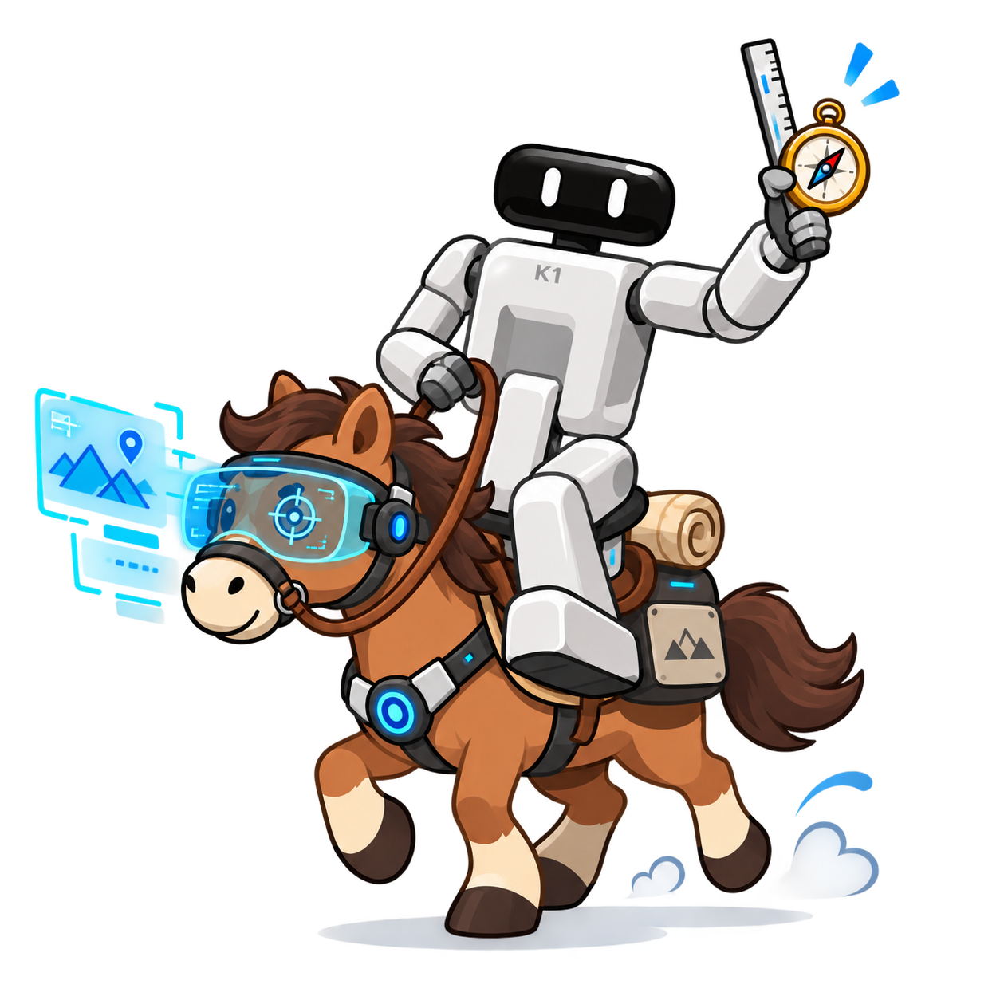
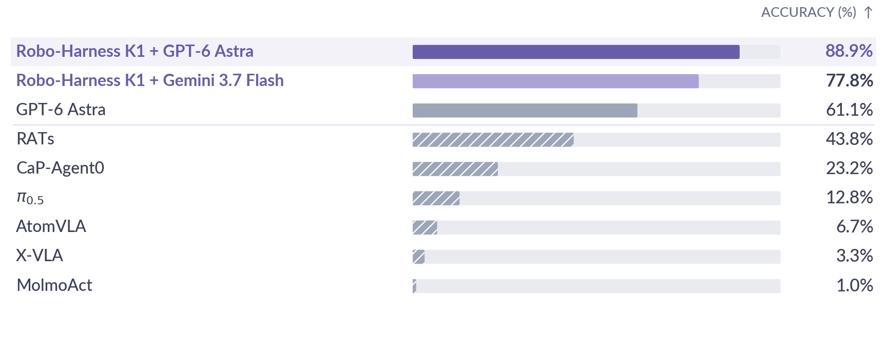
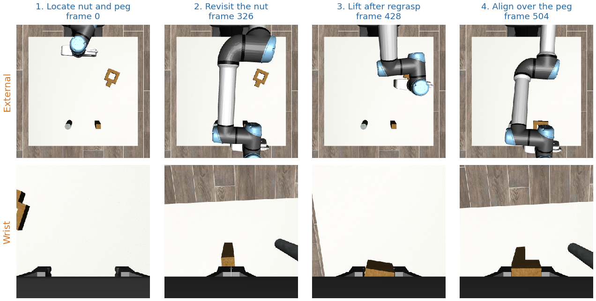
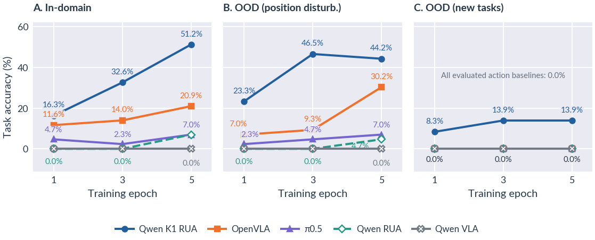
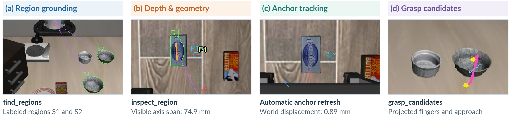

<p align="center">
  
</p>

<h1 align="center">Robo-Harness K1</h1>

<p align="center">
  <strong>Harnessing Robot-Use Agents via Perception Augmentation</strong>
</p>

<p align="center">
  <a href="#results">Results</a> ·
  <a href="#how-it-works">How it works</a> ·
  <a href="#quick-start">Quick start</a> ·
  <a href="docs/training.md">Fine-tuning</a> ·
  <a href="docs/usage_zh.md">中文</a> ·
  <a href="LICENSE">MIT License</a>
</p>

---

**Robo-Harness K1** turns a vision-language model into a robot-use agent: the model observes the scene, requests measurements, chooses an action, and checks what actually happened. Rather than asking the model to infer metric geometry from RGB alone, K1 exposes calibrated perception and robot control through a common tool interface.

This release supports **LIBERO-Pro** and **RoboSuite**, with optional interfaces for distilling successful tool-use trajectories into a smaller VLM. It contains code, configuration templates, documentation, selected paper illustrations, and synthetic tests—not datasets, model weights, episode recordings, credentials, or third-party simulator source code.

## Results

Figures from the paper. Accuracy uses the native simulator success criterion. See [evaluation details](docs/results.md) for protocols and comparison scope.

### LIBERO-Pro

<p align="center">
  
</p>

The top three rows use matched task configurations. Hatched bars are published references with different evaluation protocols, not matched reruns. Gemini + K1 achieves **77.2%** on the full evaluation; the figure shows its matched-subset result.

### RoboSuite

<p align="center">
  
</p>

Gemini + K1 transfers without target-environment fine-tuning: **90.0%** on Panda, **88.8%** on UR5e, and **86.2%** on IIWA across the shared tasks. All arms use PandaGripper. [Transfer settings →](docs/results.md#robosuite-transfer)

### Agentic post-training

<p align="center">
  
</p>

Models share the same source demonstration pool. B is the new-state development set; C contains fine-tuning-held-out task conditions, not necessarily distinct new skills. [Split definitions →](docs/results.md#learning-from-tool-use-trajectories)

## How it works

<p align="center">
  
</p>

<p align="center"><em>Tool outputs stay grounded in the existing camera views: labeled regions, metric geometry, tracked anchors, and grasp-pose schematics.</em></p>

**Observe → measure → act → verify.** The model remains responsible for selecting targets and deciding what to do next. Tools provide evidence and execution primitives—not task-specific solution scripts.

A grasp hypothesis is **not** a collision-free path or a guarantee of a successful grasp. See [architecture and execution semantics](docs/architecture.md) for tool behavior, coordinate conventions, and limitations.

## Quick start

### 1. Install the harness

Use **separate Python environments for LIBERO-Pro and RoboSuite**: their robot-controller APIs and simulator dependencies differ. Python 3.10 or 3.11 is recommended.

```bash
python -m venv .venv
source .venv/bin/activate
python -m pip install -e '.[dev]'
python -m pytest
```

This installs only the harness and tests. Follow [environment setup](docs/environments.md) for simulator dependencies, task definitions and assets. Install SAM3 and TAPNext++ separately if using the provided full-perception configurations. For geometry-only smoke tests, set `region_tools: false`, `tracking_backend: lk`, and `tracking_device: cpu`; that is a reduced configuration, not equivalent to the full system.

FFmpeg is needed for model-view MP4 generation. Model weights and external code remain under their original licenses.

### 2. Connect a model and run

Set your API key in the process environment using your secret manager or a private, ignored file. Never put it in YAML, source code or the command line. `.env.example` documents variable names; the CLI does not automatically load `.env`.

```bash
export ROBO_HARNESS_BASE_URL=https://openrouter.ai/api/v1
export ROBO_HARNESS_MODEL='your-provider/model-id'
# Supply ROBO_HARNESS_API_KEY securely in the environment.
robo-harness run --config configs/libero-pro.yaml --output outputs/libero-example
robo-harness run --config configs/robosuite.yaml --output outputs/suite-example
```

The endpoint and model ID are configurable; no particular provider or model is silently substituted. For a local OpenAI-compatible server, use a loopback URL and supply its expected key. The server must support image inputs and function tools. Remote endpoints require HTTPS. Proxy use is opt-in via `ROBO_HARNESS_PROXY`.

Before using an API, test the simulator separately:

```bash
robo-harness run --config configs/robosuite.yaml --output outputs/suite-smoke --smoke
```

Smoke mode performs one native hold action and does not call a model. Existing episode output directories are not overwritten. Formal runs archive native commands, actual model inputs, requests/responses, history, progress and native success. Generated outputs are private by default and excluded from source sharing.

### 3. Distill tool-use trajectories

The training interface prepares exact-request supervised examples and supports Qwen3.5 visual-language LoRA fine-tuning. See [training](docs/training.md) for manifest format, filtering, epoch checkpoints, and serving the resulting model through the same harness.

All data and base weights must be supplied locally by the user. No training is started by installation or import. The VLA baseline implementations, benchmark datasets, and trained checkpoints shown in the paper are not bundled in this release.

## Documentation

- [Architecture, tools and execution semantics](docs/architecture.md)
- [Paper results, evaluation settings and comparison scope](docs/results.md)
- [Environment setup and dependency boundaries](docs/environments.md)
- [Training and model-serving interface](docs/training.md)
- [Security and release checklist](SECURITY.md)
- [Third-party notices](THIRD_PARTY_NOTICES.md)
- [Validation scope](docs/validation.md)
- [中文使用说明](docs/usage_zh.md)

The algorithm name is **Robo-Harness K1**. The Python module is `robo_harness`, the distribution is `robo-harness-k1`, and the command is `robo-harness`.

## Source validation

```bash
PYTHONDONTWRITEBYTECODE=1 python -m pytest
ruff check src tests
robo-harness-audit .
```

The audit flags generated files and metadata as well as likely secrets, private paths and unexpected binary artifacts. Only the explicitly approved, checksum-pinned README images are allowed as binary assets. Run it on a clean source export without `.git` or caches. It is a heuristic check, not a guarantee that arbitrary generated logs are safe to publish.

Unit tests use synthetic observations and mocked API responses. Passing them does not establish benchmark success rates, trainability of every model release or compatibility with arbitrary simulator versions. Benchmark results require explicit end-to-end evaluation with fixed tasks, initial states, budgets and native success checks.

## License

Project code is released under the [MIT License](LICENSE). External libraries, simulators, task definitions, datasets and weights are not relicensed by this repository.
